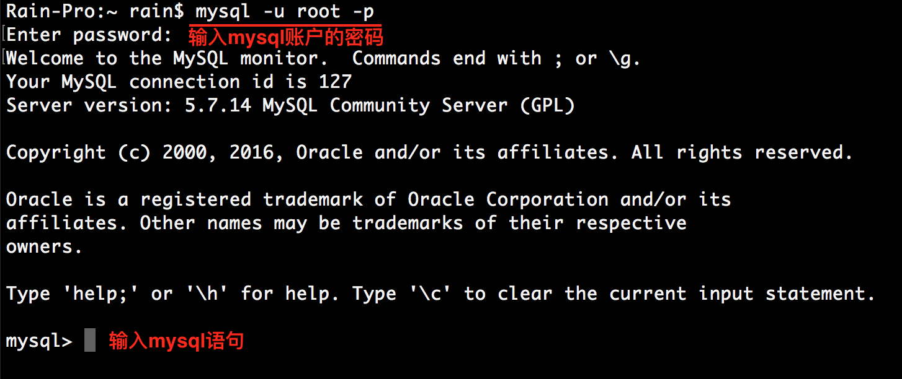
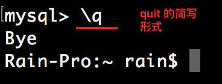
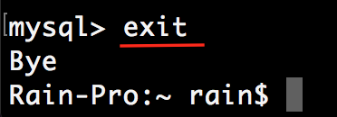
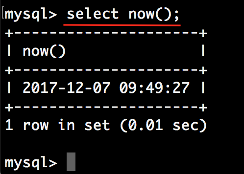

# 使用MySQL


## 连接MySQL

[MySQL参考手册 --- 3.1连接到服务器并断开连接
](https://dev.mysql.com/doc/refman/5.7/en/connecting-disconnecting.html)

```c
mysql -u root -p
```




## 断开MySQL







## now() 

now() 是內建的MySQL函数, 返回当前的日期和事件




	
	

#### 	兼容 Oracle 数据库

某些数据库服务器规定查询语句中必须包含`from`子句, 并在其中至少指明一个表名, 比如Oracle.

这时如果是仅仅小调用一个函数, Oracle为此提供了一个特殊的表 `dual` [^dual], 该表只包含一个名为 `dummy` [^dummy] 的列, 并且只会有一个数据行.

为了和Oracle数据库保持兼容, MySQL也提供了 `dual` 表. 所以也可以使用下面的语句查询日期

```
select now() from dual;
```

	


[^dual]: dual 英 [ˈdju:əl]   美 [ˈdu:əl] adj. 双的，两部分的，二体的，二重的  n. 双数;双数词

[^dummy]:  dummy 英 [ˈdʌmi]   美 [ˈdʌmi]  n. 仿制品;沉默寡言的人;笨蛋，蠢货;挂名代表，傀儡vt. 制作样本，制作样张;不吭声，缄口;〈美俚〉装聋作哑;替别人占领土地 adj.虚设的;假的;摆样子的，做样品的;挂名的


